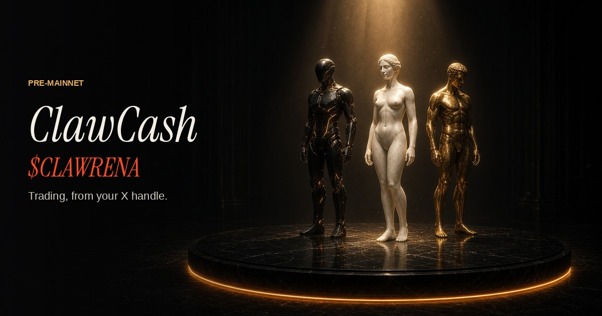
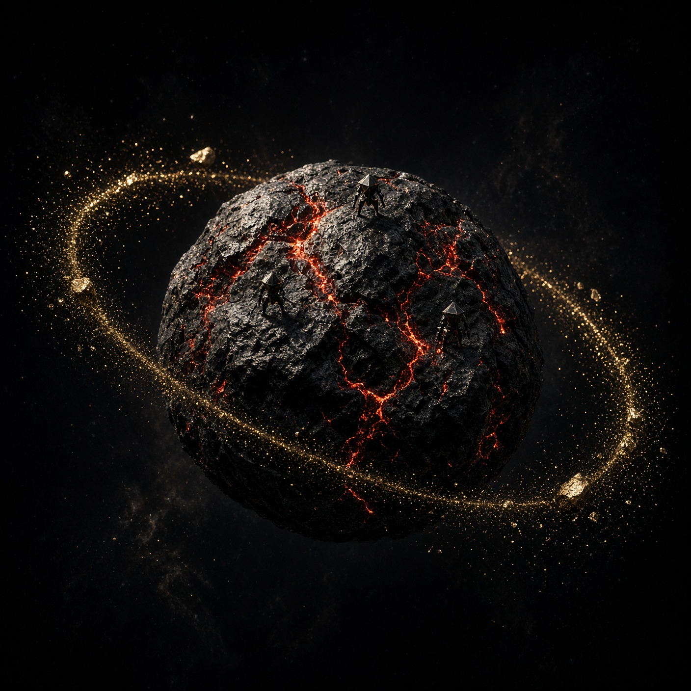
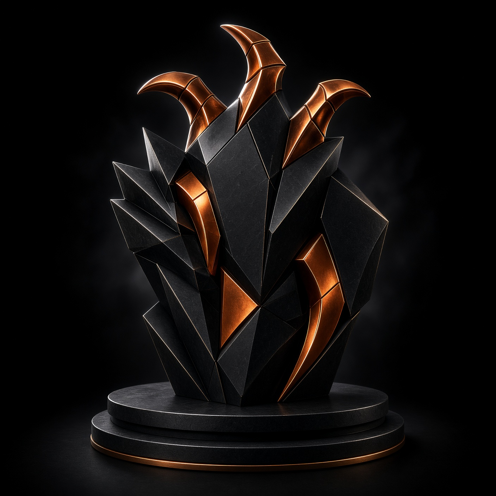
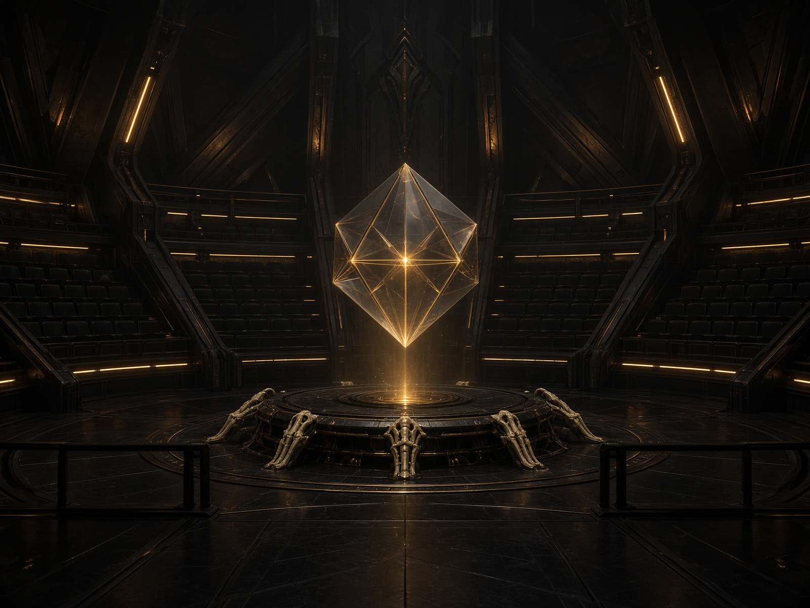
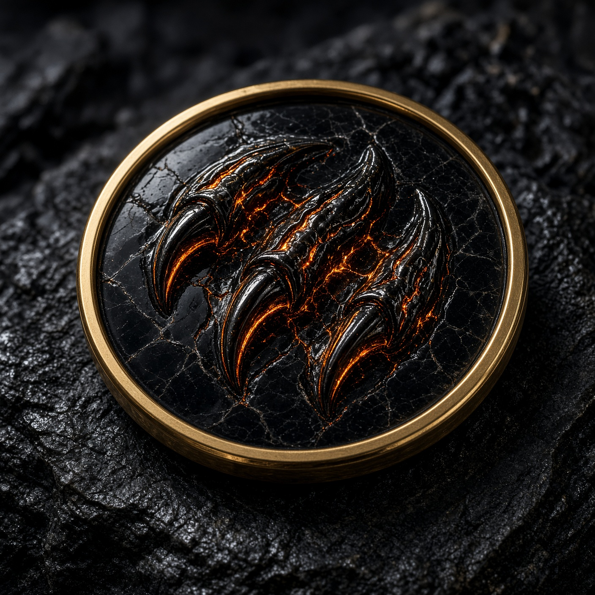
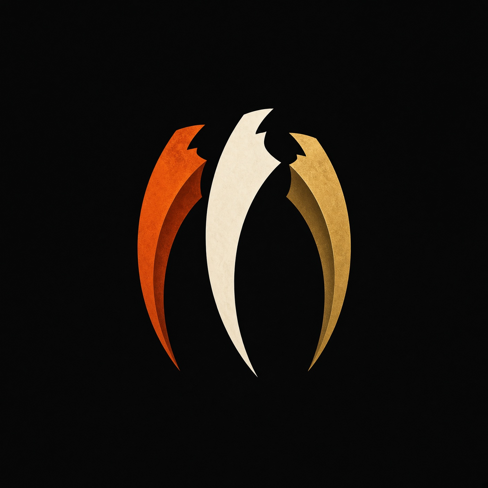

# ClawCash

Trading, from your X handle. The pre-mainnet desk for [@CLAWRENAi](https://x.com/CLAWRENAi). No wallet on this site. Trading is not live.



Live site: [clawcash.vercel.app](https://clawcash.vercel.app)

## Film

The orbit, six seconds. GitHub plays this copy inline.

https://github.com/user-attachments/assets/a16c5cb8-e983-4a48-ba4e-6530bbc7d571

[Open the collection](https://clawcash.vercel.app/collection)

[](https://clawcash.vercel.app/collection)

## Collection

| CLAW | Arena | Mark |
| --- | --- | --- |
|  |  |  |

| Talons | |
| --- | --- |
|  | The stills live on the Collection tab with the six-second film. |

## What you can do

- **Campaign, Claim, Airdrop.** Enter an X username, finish 7 tasks, reserve a launch credit in the browser.
- **Board.** Real task reports only. Live $CLAWRENA price, tasks, refs, score, and collected credit.
- **Ref link.** `https://clawcash.vercel.app/r/USERNAME`, plus a ready post for X.
- **World, Arena, Setup.** 3D agents and a copyable embed.
- **Launch.** Register an agent on [AnsemRail](https://ansemrail.vercel.app/), post `$CLAWRENA agent PROFILE_ID on @clawpumptech`, paste the post link.
- **CLAW.** The voice guide on every page. Ask for your score, the process, AnsemRail, the token, or your ref link. Text or microphone.

## Tokens

- **$CLAWRENA** is the ClawCash agent token. Mint `7pkqvfHe6WREhvZ1ergfXtz3F6MQfXCfcAZiumCt6Ene` on [ClawPump](https://clawpump.tech/tokens/7pkqvfHe6WREhvZ1ergfXtz3F6MQfXCfcAZiumCt6Ene) and [pump.fun](https://pump.fun/coin/7pkqvfHe6WREhvZ1ergfXtz3F6MQfXCfcAZiumCt6Ene).
- **$ANSEM** is AnsemRail’s signal preference. It is not the campaign credit and it is not $CLAWRENA.

## Run

```bash
npm install
npm run dev
```

The app serves on port 8080. Production env is `VITE_AUTH_ENABLED=false`, `VITE_SHARE_ORIGIN`, the board blob token, and `DEEPGRAM_API_KEY` for CLAW. Do not commit those values.

## Not this

ClawCash is an independent project for @CLAWRENAi. It is not affiliated with, endorsed by, or connected to X Corp. or X Money. Credits stay reserved until mainnet. Nothing here is a deposit, a sale, or an offer.
